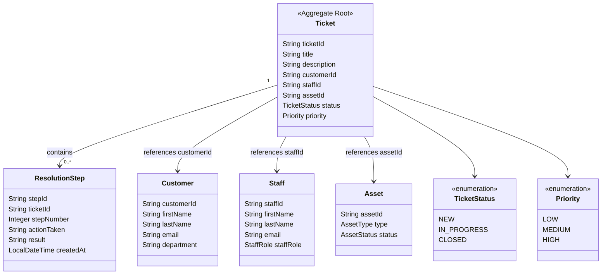
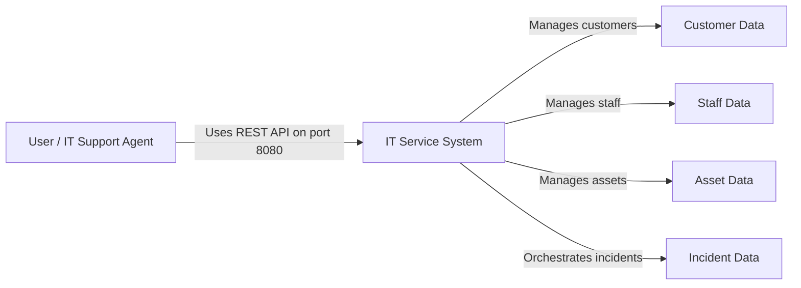
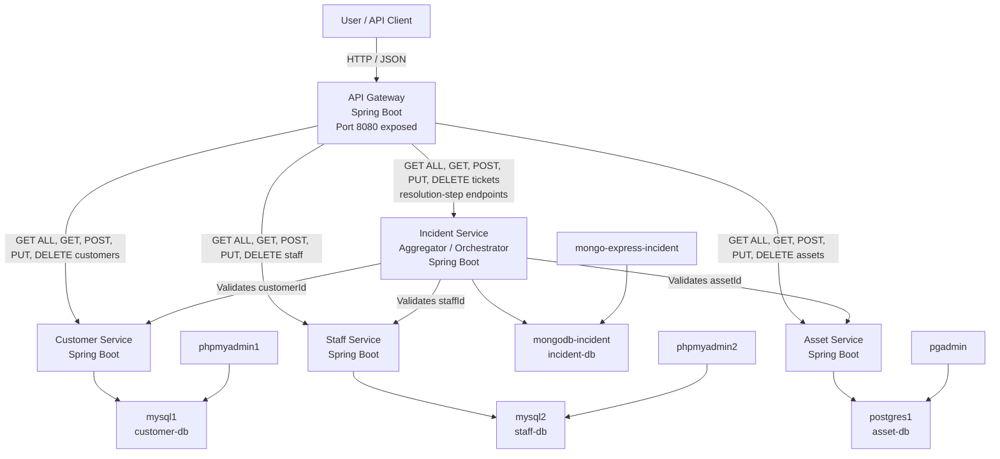

# IT Service - Milestone 2 Design

This document updates the DDD Domain Model and C4 diagrams for Milestone 2.

## DDD Domain Model

Aggregate invariant: a resolution step can only be added to an existing ticket whose status is not `CLOSED`.

## C4 Level 1 - System Context

## C4 Level 2 - Containers

## Implementation Traceability

| Requirement | Implementation |
| --- | --- |
| API Gateway exposes all downstream endpoints | `apigateway` controllers for assets, customers, staff, tickets, and resolution steps |
| Aggregator orchestrates all three low-level services | `incident-service` calls customer, staff, and asset domain clients before creating/updating tickets |
| Aggregator persists aggregate in Mongo | `incident-service` uses Spring Data MongoDB and `mongodb-incident` in Docker |
| Aggregate invariant | `ResolutionStepServiceImpl` rejects resolution steps for closed tickets |
| Only API Gateway exposed outside Docker | `Docker-compose.yaml` only publishes `8080:8080` |
| Required testing types | Repository integration, controller integration, service unit, and controller unit tests are present |
| Bash script tests through API Gateway | `api-gateway-tests.bash` uses only `http://localhost:8080/api/v1` |
